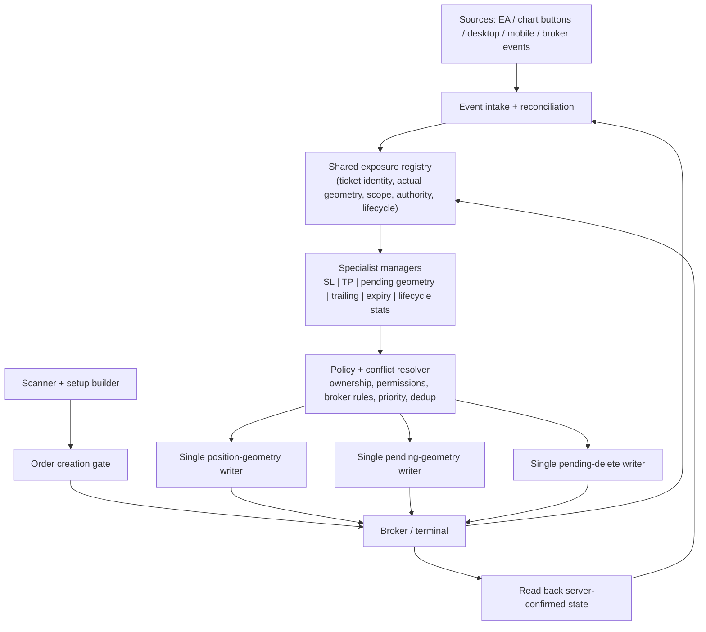
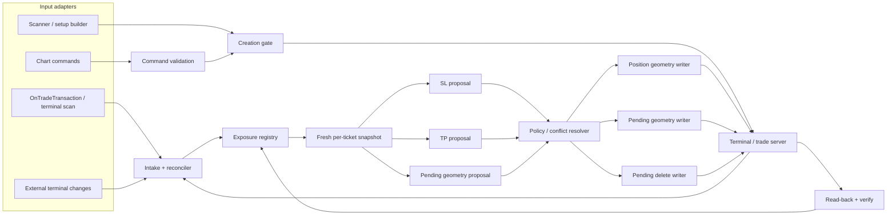

# SmartTradingBot_FINAL — Root Audit Blueprint

Status: work in progress. This is the working checklist for the review branch; it is not a claim that the EA is compiled or runtime-validated.

## Reference
- User-supplied product/reference page: https://www.mql5.com/en/market/product/171441
- Treat this as a conceptual reference only. No proprietary marketplace source is copied into this repository. The page could not be retrieved by the current web connector, so product-specific claims are intentionally not made.

## Safety and release boundaries
- All edits stay on `audit/expose-cleaned-source-20261009`.
- Do not sync this branch to the live MetaTrader `Experts` folder.
- Do not compile the terminal copy until the static audit and refactor are complete.
- Keep `main` and its backup archive untouched until one consolidated final release is ready.
- Compilation, visual inspection in MT5, Strategy Tester results, and demo-forward behavior are separate release gates. None may be marked passed from static analysis alone.

## System invariants
1. One central position-SL writer and one central pending-geometry writer.
2. Verify ticket ownership, symbol permissions, broker stop/freeze distance, tick-size alignment, monotonic SL/entry movement, and server-confirmed geometry.
3. Manual geometry edits grant per-ticket manual authority; automatic trail/profit-protection must not overwrite it until the explicit AUTO action clears that authority.
4. New/recovered exposures must seed ticket geometry and pending-trail recovery state before automated writes.
5. Protect every managed position/pending with a valid initial SL where the user has not explicitly taken manual control.
6. A pending trail may only update its own pending ticket. Once filled, the position manager owns the position.
7. Never increase the accepted structural risk through pending trailing; do not loosen a position SL.
8. Risk sizing must fail closed when a valid cash-risk calculation or legal volume cannot be obtained.
9. Strategy signals must use closed/confirmed bars and must not use future data.
10. Adaptive learning must count genuine discovery/outcome events, not repeated revalidation passes.

## Audit workstreams

### A. Strategy and Buy Stop / Sell Stop geometry
- Confirm H4 bias uses confirmed swings and matches the timestamp of the closed candle being evaluated.
- Confirm M15 structure break uses only pivots that were confirmed before the breakout candle.
- Confirm FVG/OB must be tied to the setup's BOS/displacement, not an unrelated pattern.
- Confirm Buy Stop entry is above the live Ask by a broker-valid distance; Sell Stop entry is below the live Bid.
- Build SL beyond the actual OB risk-side extreme, or the nearest confirmed pre-BOS opposite swing when OB is optional and absent.
- Compute TP/RR after final tick/broker normalization, and reject stale triggers that have already crossed.

### B. Position manager and trailing
- Single-cycle priority: establish missing initial SL first, then profit-lock, then live trailing.
- Profit calculations must be net-of-known opening commission and swap; fail closed if pip cash value cannot be computed.
- Only submit SL changes that improve protection and pass current broker distances.
- Verify the broker's final SL after a successful retcode; refresh geometry from actual terminal values on failures.
- Avoid repeated high-volume debug logging inside tick-level paths.

### C. Pending order manager
- Cover BUY/SELL STOP, BUY/SELL LIMIT, and STOP-LIMIT order types consistently.
- Use per-ticket state, restart reconstruction, bounded retries/backoff, cooldown/step gates, and single central writer.
- Preserve the trigger-to-limit offset on STOP-LIMIT modifications and verify the child limit price after modification.
- Prune inactive/completed ticket state so lifetime memory does not grow with all historical pending orders.
- Confirm manual order edits reset the trail baseline and retain manual authority.

### D. Exposure ownership, restart, and manual authority
- Seed exposure geometry before the first management cycle on attach/restart.
- Seed a new pending order's initial terminal geometry at first transaction intake.
- Transfer per-ticket manual authority from a pending ticket to the filled position where applicable.
- Reconcile closed tickets and stale persistence without affecting unrelated accounts/magics.
- Confirm symbol lease ownership is verified immediately before all broker writes.

### E. Scanner, adaptive engine, and risk
- Distinguish scanner discovery from final candidate revalidation so repeated rebuilds do not inflate adaptive attempts.
- Keep final candidate revalidation on current market data and require the same closed setup timestamp.
- Check symbol-specific trading mode, order permissions, spread, quote age, session, volume limits, pending lifetime, and account trade permissions before placement.
- Verify trade outcomes are aggregated across partial exits and adaptive statistics update only once when a position lifecycle closes.

### F. Source quality and release verification
- Remove only symbols proven to be dead; keep all active strategy logic.
- Run static checks for malformed comments/strings, brace balance, duplicate definitions, unresolved references, and writer counts.
- Then perform one clean MetaEditor compile of the consolidated source and record the exact source hash, compiler output, and resulting EX5 hash.
- Only after compile review: run Strategy Tester on representative symbols/regimes and inspect logs for rejected geometry, modification failures, trailing behavior, and manual-override protection.
- Only after those gates pass: create one consolidated ZIP/commit, update `main`, and perform a single transfer to the canonical terminal.

## Incremental fixes saved on this review branch
- AUTO clears manual overrides only when enabling AUTO, not when disabling it.
- Pending-trail state is rebuilt before the first management cycle and inactive trail records are pruned during processing.
- Exposure geometry is reconciled before the first management write; new managed pending orders seed their initial geometry on intake.
- Revalidation rebuilds no longer increment adaptive attempt counts.
- Net pip-profit conversion returns zero when a valid pip cash value cannot be obtained instead of falling back to gross price movement.
- Per-tick P5A diagnostic spam was removed from the central position-SL writer.
- Setup cooldown timestamps are committed only after a pending order's initial SL is verified.
- H4 trendline validation evaluates the closed candle at its corresponding close time.
- Initial setup SL now anchors beyond the actual OB extreme or a confirmed pre-BOS opposite swing instead of using the already-broken trigger pivot as a near-entry stop.
- Manual pending/hedge commands are being guarded against terminal/account and symbol-direction permissions.

## Known limitation
The changes above are static-review changes only. No compile or runtime pass is claimed for this review branch. Continue auditing, update this document as each workstream is proven, and do not release until every gate has evidence.

## House map — first structural pass (inventory, not functional sign-off)

This is the repository's current architectural map. "Located" means the code/file exists; it does **not** mean its behavior is verified. Each house is audited for responsibility, state ownership, authorized doors, and failure containment.

### Site / foundation
- **Build target:** `MQL5/Experts/SmartTradingBot_FINAL.mq5` (8,665 lines; primary EA; observed blob SHA `955d9961e3da1d855a162ac6f4acf7bf7fc852b8`).
- **Platform boundary:** `#include <Trade/Trade.mqh>` and the terminal/broker API (quotes, symbol permissions, positions, orders, history, terminal Global Variables, timers and chart events).
- **Project-owned include houses:** `MQL5/Include/STB/STB_PendingDistanceResolver.mqh`, `MQL5/Include/STB/STB_PendingTrail.mqh`; adjacent `MQL5/Include/AC/AC_ManualAnalysis.mqh` and `AC_SmartStructure.mqh` are present in the tree, but direct inclusion/use by the primary EA has not yet been established.
- **Release artifact warning:** a compiled `MQL5/Experts/SmartTradingBot_FINAL.ex5` is present in the branch. Its provenance/source correspondence has not been established; it is not evidence that the current MQ5 source compiles.
- **Map/progress records:** this blueprint is the canonical map; `AUDIT_PROGRESS_20261009.md` is the evidence/status log. No new audit folders/files are required.

### Houses, rooms, families, and doors

| House | Main rooms / family | State it owns | Authorized doors / links | Audit status |
|---|---|---|---|---|
| **H0 — EA host & policy foundation** | Inputs; constants; data structures (`Setup`, swing/trend/oscillator/adaptive structs); price/volume normalization; symbol/trading-environment checks | EA-wide policy/configuration and shared utility behavior | Terminal API; calls into other houses through named functions | Located; boundaries under audit |
| **H1 — Market structure & setup construction** | Rates; swing collection; H4 trend/bias; M15 CHoCH/BOS; displacement; FVG; origin/OB; structural SL anchor; setup scoring | Candidate `Setup` data, timestamps, structural prices | Produces setup for scanner/execution; reads market data | Located; temporal correctness not yet signed off |
| **H2 — Adaptive learning & lifecycle statistics** | Profile selection/UCB; attempt counters; setup/profile persistence; position/order profile and risk association; close-deal aggregation | Profile counters, profile identity, lifecycle PnL/risk records | Receives setup and confirmed lifecycle events; must not mutate trade geometry | Located; event-counting/restart boundaries under audit |
| **H3 — Scanner, regime & candidate ranking** | Universe/watchlist; quote/session eligibility; regime and quality scoring; candidate stability/sort/top candidate; final revalidation | Candidate list and scanner diagnostics | Reads H1 setup and market eligibility; passes final candidate to H4 | Located; freshness and duplicate-work boundaries under audit |
| **H4 — Order construction & execution gate** | Pending geometry validation; risk-volume calculation; expiry; final gates; automatic/manual STOP/LIMIT placement; hedge command | Proposed order geometry and placement result | Sole approved order-creation paths should be explicit; crosses broker boundary | Located; all write gates not yet fully proven |
| **H5 — Exposure registry & authority** | Managed ticket/symbol ownership; geometry snapshots; manual override persistence/intake; symbol lease; cycle write dedup; restart reconciliation | Per-ticket ownership, geometry baseline, manual authority, leases | Transaction intake, managers, and broker writers; must block cross-ticket/symbol writes | Located; critical boundary under audit |
| **H6 — Position protection** | Initial SL; profit lock; net pip profit; live trailing; per-cycle position management | Position SL proposal/lock state and accumulated position outcome data | Proposals flow to central position-SL writer; must not loosen SL or override manual authority | Located; state/retcode paths under audit |
| **H7 — Pending-order lifecycle** | Initial pending SL; per-ticket pending trail; retry/backoff/cooldown; restart reconstruction; pending delete; trigger handoff | Pending entry/SL/TP baseline, tracked extreme, retry state | Resolver → central pending geometry writer; central delete door; on fill hands off to H6 | Located; STOP/LIMIT/STOP-LIMIT and ownership paths under audit |
| **H8 — Dashboard & chart controls** | Panel/buttons/visual levels; AUTO toggle; manual STOP/LIMIT/HEDGE/SAVE/TRAIL actions | UI state and explicit user commands | Commands route to H4/H5/H6/H7; UI must not write broker geometry directly | Located; command authorization under audit |
| **H9 — Event and lifecycle orchestrator** | `OnInit`, `OnDeinit`, `OnTick`, `OnTimer`, `OnTradeTransaction`, `OnChartEvent`; `STB_RunManagementCycle` | Event sequencing and per-cycle lifecycle | Tick/timer → single management cycle; trade transaction → exposure intake and closed-deal accounting | Located; ordering/race semantics under audit |

### Physical boundary observations (not yet defect verdicts)
1. The primary EA contains most houses in one 8,665-line translation unit; only pending-distance resolution and pending trailing are separate project-owned STB include files. These are **logical** walls, not compiler-enforced module boundaries.
2. The two STB includes are brought in near the end of the primary EA (around lines 8115–8116), immediately before lifecycle helpers/events. Type visibility, call ordering, and any pre-include references must be checked before changing include placement.
3. The `AC` include files exist but are not among the primary EA's direct `#include` directives. Their status (legacy, standalone, or indirectly required) remains unresolved.
4. The EA source and an EX5 binary coexist in the branch. Until a clean compile records the exact MQ5 hash and output, the EX5 must be treated as an unverified artifact.
5. Repository inventory contains 273 blob files, including broad MQL5 include-library material. Audit scope will distinguish project-owned code from platform/library code; it will not mechanically rewrite vendor/platform libraries.

### Audit evidence protocol
For every house, record: (a) source locations and state variables; (b) public doors/callers; (c) writes and their authorization gates; (d) failure/retcode behavior; (e) restart/manual-edit behavior; (f) cross-house interference tests; (g) evidence and remaining unknowns. Use only **Located**, **Static evidence found**, **Issue confirmed**, **Needs runtime/compiler evidence**, or **Verified within stated scope**. No house is globally "verified" from inventory alone.

## House H7/H5 boundary finding — pending deletion door (static finding; fix not yet applied)

**Finding ID: H7-H5-001 — central delete writer does not enforce the symbol lease at its own boundary.**

Evidence in `MQL5/Experts/SmartTradingBot_FINAL.mq5`:
- `STB_ModifyPendingOrderGeometry()` (around line 1868) checks `STB_SymbolManagementOwnedVerified(symbol)` before issuing `trade.OrderModify`.
- `ModifyPositionSL()` (around line 4680) checks the same verified lease before `trade.PositionModify`.
- `STB_ExecuteOrderDelete()` (around line 8135) selects the ticket and checks neither `STB_SymbolManagementOwnedVerified(symbol)` nor an explicit narrowly scoped authorization token before `trade.OrderDelete`.
- Delete requests are routed through `STB_RequestOrderDelete()`, but that wrapper currently delegates directly to the writer without adding authorization.

**Why the wall matters:** callers such as pending-expiration management are lease-gated before they reach the delete door, but creator rollback paths also call the central delete wrapper. A caller-side check alone is not a durable boundary contract: a future/new caller can bypass it. The single broker-write door should enforce its own authorization, with any deliberate rollback exception explicit and narrow.

**Status:** issue confirmed by source inspection; full caller inventory and safe fix design still in progress. No code change has been made for this finding yet. Before fixing, trace every `STB_RequestOrderDelete` caller and decide how a failed initial-protection rollback can safely delete only the exact order created by that request without violating cross-instance ownership. Then add a targeted static regression check. Runtime/compiler validation remains required.

### H7-H5-001 — caller trace update

All direct call sites found in the primary EA:
- `ManagePendingOrders()` → `STB_RequestOrderDelete(...SERVER_EXPIRATION...)` around line 5737. This path has a preceding `STB_SymbolManagementOwnedVerified(symbol)` check around line 5693.
- `PlaceSetup()` → rollback after accepted order lacks verified initial SL, around line 6176.
- `PlaceManualPendingDirection()` → rollback after accepted STOP order, around line 6504.
- `PlaceManualLimitDirection()` → rollback after accepted LIMIT order, around line 6602.
- `OneClickHedge()` → rollback after accepted hedge pending, around line 4047.
- `STB_RequestOrderDelete()` itself delegates to `STB_ExecuteOrderDelete()` around lines 8181–8185, with no authorization policy of its own.

The four rollback callers are not preceded at the call site by a visible `STB_SymbolManagementOwnedVerified(symbol)` check in the inspected ranges. This does **not** by itself prove they are always unauthorized; it does prove that the central delete door does not independently enforce the invariant. A naive guard added only inside delete could also prevent cleanup of a just-created order if the creator has not acquired the lease. The fix therefore needs coordinated review of the creation gates, lease acquisition, and rollback semantics; do not patch the delete writer in isolation.

## Source-of-truth search — master map not located

A repository-wide tree/name inventory was checked on both available branches (`main` and `audit/expose-cleaned-source-20261009`):
- Only two branches are exposed by the repository.
- The `main` branch root contains only `SmartTradingBot_FINAL_CLEANED_BACKUP_20261009_033230.zip`; it has no browsable source tree or separate architecture document.
- The audit branch contains the working `docs/ROOT_AUDIT_BLUEPRINT.md` and `AUDIT_PROGRESS_20261009.md`, but no separately named master map / architecture contract / system blueprint file was found in the repository tree.
- The EA source contains comments referring to “MASTER BLUEPRINT” and numbered blueprint rules, but these references are not themselves the complete master map and cannot safely be used to reconstruct its full meaning.

**Conclusion:** the canonical master map has **not been located** in the accessible repository contents. The house map above remains a provisional, code-derived inventory only; it must not be treated as a replacement for the user's original master map. Keep the current map clearly labeled provisional until the original document is found or supplied. No source code or release artifact was changed as part of this search.

## Master map — target architecture (source-neutral collaboration)

**Status: proposed architecture target derived from the user's requirements and the current code inventory. This is not yet a statement that the implementation conforms.** Keep this map deliberately small: one shared view of exposures, specialist decision-makers, and a few controlled write doors.

### Four rules that define the whole map

1. **Origin-neutral coverage:** once an exposure is inside the explicitly authorized account/symbol scope, its origin (EA, chart command, desktop, mobile, or broker-side event) does not decide which protection manager may inspect it. The manager decides from current state and its responsibility, not from who created it.
2. **One owner for each kind of state:** the exposure registry owns canonical per-ticket snapshots and authority metadata; specialist managers own only their private calculation/retry state; the policy resolver owns conflict resolution; central writers alone perform broker mutations.
3. **No neighbor-house writes:** a manager may read another house only through a named interface or shared read model. It may submit a proposal, never modify another house's private state or call a broker mutation directly.
4. **Verify, then reconcile:** a successful local API return is not enough. Re-read the terminal/server state, confirm the intended ticket and geometry, and update the shared registry from observed state. If confirmation fails, record the failure and reconcile before retrying.

### Responsibilities at a glance

- **Event intake / reconciler:** normalize events from all origins; reconcile current orders and positions on attach/restart; tolerate duplicate, delayed, or reordered events; do not assume a transaction callback is a complete snapshot.
- **Exposure registry:** canonical ticket/position identity, actual server geometry, authorized scope, manual-control mode, pending-to-position lifecycle links, and restart recovery metadata.
- **SL manager:** propose safe, valid SL geometry for every in-scope exposure it owns; never write to the broker itself.
- **TP manager:** propose TP geometry using the same current snapshot and shared conflict policy; never write to the broker itself.
- **Pending manager:** propose pending entry/SL/TP/trail/expiry changes for that pending ticket only; hand off when it fills.
- **Scanner/setup builder:** discover candidates and produce proposals only; it is not the owner of existing exposure protection.
- **Creation gate:** validate a new order proposal and permissions; creation is separate from management of exposures already found.
- **Policy/conflict resolver:** enforce scope, symbol lease, account/terminal permissions, broker stop/freeze and tick-size constraints, monotonic-protection rules, per-cycle deduplication, and priority between competing proposals.
- **Central writers:** the only code allowed to modify position geometry, modify pending geometry, or delete pending orders. Each writer independently enforces authorization and verifies the server result.
- **Lifecycle/statistics:** consume confirmed events/outcomes; must not mutate geometry or inflate counts through repeated reconciliation.
- **UI/chart controls:** express user intent through commands; no direct broker writes from UI code.

### One policy point that must be resolved before code changes

The new source-neutral goal changes how the existing blueprint currently describes manual edits. The old rule treats a manual geometry edit as per-ticket manual authority until AUTO is explicitly enabled. The proposed map separates **origin** from **authority**: origin never excludes an exposure from inspection, while a deliberate, explicit **MANUAL HOLD** state may suspend automatic proposals for that ticket. A manual edit alone should not silently become a permanent bypass if the intended goal is automatic protection for all sources. This is a design decision to confirm; do not change code until it is settled.

### Current-code fit and known gaps

- The current EA already has a shared management cycle and central mutation paths for position modification, pending modification, and pending deletion. This is a useful starting shape, but it does not prove every writer enforces the same authorization contract.
- The static finding **H7-H5-001** remains open: the central pending-delete writer does not enforce the symbol lease at its own boundary. Resolve the creation/rollback exception deliberately; do not add a blind guard that can block cleanup of a newly created invalid order.
- The houses mostly live inside one large EA translation unit. These are logical boundaries until code structure and call paths enforce them.
- This target map is informed by Microsoft's guidance on explicit component responsibilities/dependencies and AWS guidance on bounded contexts/interfaces, plus MQL5's official description of terminal-originated trade transactions and the possibility that state can change while an event handler runs. See:
  - https://learn.microsoft.com/azure/architecture/guide/architecture-styles
  - https://learn.microsoft.com/azure/architecture/guide/design-principles
  - https://docs.aws.amazon.com/prescriptive-guidance/latest/hexagonal-architectures/overview.html
  - https://www.mql5.com/en/docs/constants/structures/mqltradetransaction
  - https://www.mql5.com/en/docs/basis/function/events

### Acceptance tests for the map (not yet run)

- An in-scope exposure created by EA, desktop, mobile, or chart command is discovered and reconciled without relying on its origin.
- SL and TP proposals for the same ticket are resolved from one fresh snapshot; neither writer can erase the other's update through stale geometry.
- No specialist or UI component can reach broker mutation APIs except through the central writers.
- Every central writer independently checks ticket identity, authorized scope, symbol lease/permissions, broker constraints, and final server state.
- Restart, duplicate/reordered trade events, partial fills, pending-to-position transition, and failed modification leave the registry consistent with observed terminal state.
- A ticket outside the authorized scope is never modified, even if visible to the EA.
- Explicit manual hold / AUTO resume semantics are deterministic and documented before implementation.

## Precise contract map — ownership, interfaces, ordering, and invariants

This section sharpens the target map into contracts that can be checked against source. It is intentionally a **code-audit specification**, not a claim of runtime correctness.

### A. Canonical flow and permitted dependencies

Dependency direction is one-way: input adapters may submit commands/events; specialist managers may read snapshots and submit proposals; the resolver may approve/reject/merge proposals; only central writers may call broker mutation APIs. No manager or UI calls a broker mutation directly. A writer must not call back into a specialist to decide policy.

### B. Ownership matrix

| State / object | Sole logical owner | Other houses may do | Must never do |
|---|---|---|---|
| Live order/position facts | Terminal/server; registry mirrors observed facts | Read a fresh snapshot; request reconciliation | Treat a cached snapshot as authoritative after an external change |
| Per-ticket observed geometry (entry, SL, TP, type, volume, symbol, lifecycle) | Exposure registry / reconciler | Propose a desired change | Write another ticket's record or fabricate a server-confirmed value |
| Manual authority / scope / lease | Authority policy in H5 | Ask whether a command is allowed | Infer ownership from symbol alone or bypass the policy |
| SL calculation/protection state | SL manager H6 | Submit candidate + reason + source | Call `trade.PositionModify` directly or change TP policy state |
| TP calculation state | TP manager (target responsibility; current integration not yet proven) | Submit TP candidate + reason + source | Call `trade.PositionModify` directly or overwrite SL with stale data |
| Pending trail anchor, retry/backoff, cooldown | Pending trail H7 | Submit a proposal for its own ticket | Manage a filled position or modify a different ticket |
| Candidate/setup and scanner ranking | H1/H3 | Submit a new-order proposal to H4 | Manage existing exposure geometry |
| Adaptive profile/outcome records | H2 | Consume confirmed lifecycle facts | Decide broker geometry or count every repeated reconciliation as a new event |
| UI state and user intent | H8 | Issue validated commands through H4/H5/H6/H7 | Mutate order/position geometry directly |
| Cycle sequencing and intake | H9 | Trigger one reconciliation/management pass | Run duplicate management engines from separate events |
| Broker mutation | Central writers only | Receive an approved patch/delete request | Be called by scanner, UI, trail, or stats code directly |

### C. Contract for every exposure

Each order or position that is inside the explicitly authorized scope must be represented by a canonical record keyed by a stable ticket/position identity, not merely by symbol. The record should distinguish:

- **Observed facts:** ticket, symbol, object kind, order/position type, current entry, current SL, current TP, volume, current lifecycle status, and last observed server state.
- **Authority facts:** why the object is in scope, whether this instance owns the symbol lease, whether user manual hold is active, and which operations are permitted.
- **Manager-private state:** SL calculation metadata, TP calculation metadata, pending trail anchor/retry state, and adaptive association. These remain in their owning house.
- **Reconciliation metadata:** last event/scan time, last confirmed geometry, last requested patch, and result classification. A requested value must never be recorded as confirmed before terminal read-back.

The registry is a read model of terminal truth, not a substitute for it. On conflict between cached and terminal values, terminal values win and the registry is reconciled.

### D. Proposal and writer contracts

**Position geometry.** In MQL5, `CTrade::PositionModify` takes both SL and TP values in one operation. Therefore the target architecture must not have independent SL and TP modules each write a full geometry pair from stale snapshots. Instead:

1. SL and TP managers independently submit typed proposals against the same fresh ticket snapshot.
2. The resolver merges the proposals into one final position geometry patch, preserving the observed value of any field with no approved proposal.
3. The central position writer reselects the ticket, re-reads current SL/TP/type/symbol, checks authorization/lease and broker constraints, then issues one modification.
4. It checks the trade-server retcode and re-reads the terminal values; it updates the registry only from observed values.
5. If the object changed after the snapshot, reject/reconcile and recompute rather than blindly retrying stale geometry.

**Pending geometry.** Entry, SL, TP, expiration, and (for STOP-LIMIT) stop-limit price form one coherent proposal for one order ticket. The resolver validates order type and the full geometry together. Only the pending writer can apply it; a trail module cannot write its own broker state.

**Delete.** Delete is a distinct command, not a side effect of arbitrary state cleanup. The delete writer must reselect the exact active ticket, verify that it remains within authorized scope, check a narrow reason-specific permission, send the request, validate the server retcode, and verify the ticket is no longer active. Rollback of a just-created invalid order needs an explicit narrow authorization path; do not make a blanket exception for all deletes.

**Creation.** New-order creation is separate from managing discovered exposures. The creation gate validates the command and permissions, creates the order, then sends the confirmed ticket through the same intake/registration/initial-protection path. The source of the command (automatic scan, chart action, or other terminal-side action) is metadata, not a reason to skip registry intake.

Official MQL5 references confirm that `PositionModify` accepts both SL and TP and that its boolean return alone does not prove server execution; the result retcode must be checked. `OrderModify` has the same retcode requirement. See the official references below.

### E. Deterministic management-cycle order

1. **Intake/reconcile:** process pending transaction notifications quickly; rescan current terminal state to repair missed, delayed, duplicated, or reordered observations.
2. **Freeze a fresh snapshot:** identify each in-scope ticket and record the geometry/authority version used for this pass.
3. **Collect proposals:** managers calculate candidates without writing to the broker.
4. **Resolve conflicts:** combine position SL/TP proposals and pending-field proposals; enforce priority, authority, directionality, broker constraints, and per-ticket write deduplication.
5. **Authorize at the writer boundary:** reselect ticket and re-check scope, lease, object type, symbol permissions, current geometry and server constraints immediately before mutation.
6. **Write once per ticket per cycle:** serialize writes and avoid two competing requests for the same object.
7. **Verify server state:** inspect retcode and actual terminal state; do not assume a local `true` equals a completed server-side change.
8. **Reconcile outcomes:** confirmed values update the registry; rejection or ambiguity records the failure and triggers a later fresh reconciliation, not an immediate unbounded retry.
9. **Lifecycle accounting:** update adaptive/statistical state only from genuine confirmed lifecycle events, idempotently.

MQL5 documents that multiple trade-transaction events can arise from a request, the account can change while `OnTradeTransaction` is running, and the event queue is bounded. Therefore transaction intake should be short, idempotent, and followed by reconciliation; it should not be treated as an atomic snapshot of account state.

### F. Authority policy: origin-neutral, scope-bound

- **Origin-neutral:** EA-created, chart-created, desktop/mobile-created, and externally changed objects are all eligible for discovery if they fall within the agreed scope.
- **Scope-bound:** “manage everything visible” is not safe as a default. Scope must explicitly define account, symbol, magic/manual-trade policy, object types, and whether other EAs' or unrelated user trades are excluded. A visible object is not automatically an authorized object.
- **Manual hold:** a user action can explicitly set a per-ticket hold. While held, automatic proposals are blocked for the fields covered by that hold; the UI must show the hold and the exact resume action.
- **AUTO resume:** resume clears only the intended hold/override and re-reconciles current geometry before automated management resumes. It must not reset unrelated tickets or silently grant broad account scope.
- **Lease:** a symbol lease coordinates cooperating instances, but it does not by itself prove that a ticket is in scope. Check both ticket scope and lease at each write door.
- **External manual edit:** record the observed change as an event, classify it according to the explicit manual-hold policy, and refresh the baseline. Do not infer permanent manual authority merely from a geometry difference unless that is the confirmed product rule.

**Open product decision:** the current code has manual-override checks in automatic position/pending modification paths. The user's origin-neutral goal needs a final explicit rule for whether manual edits automatically create MANUAL HOLD or merely update the baseline while auto-protection continues. Do not change that behavior until the rule is agreed.

### G. Current-source mapping and exact known limits

- H9 contains `STB_RunManagementCycle()`, called from `OnTick` and `OnTimer`; trade-transaction intake calls `STB_TradeIntakeFromTransaction()`. This is a recognizable orchestration starting point.
- H5 contains ticket geometry tracking, manual-override detection, cycle write deduplication, and symbol-lease helpers.
- H6 currently contains a central position-SL path and calls `trade.PositionModify(ticket,newSL,tp)`. A unified SL+TP proposal resolver is a target contract; the source inspected so far proves an SL proposal path, **not** a complete independently verified TP-manager integration.
- H7's pending-trail include explicitly proposes geometry and delegates writes to `STB_ModifyPendingOrderGeometry()`; it stores per-ticket trail/retry state.
- The central pending writer checks managed-order scope, manual override (for automatic requests), symbol lease, entry direction, risk floor, and stop-limit offset handling.
- **H7-H5-001 remains open:** `STB_ExecuteOrderDelete()` does not enforce the symbol lease/authorization policy at its own boundary. The caller and rollback semantics must be reconciled before fixing it.
- The primary source remains a large translation unit; these are logical contracts, not compiler-enforced module walls. Do not create a forest of new files just to make the diagram look modular.

### H. Evidence-based acceptance checklist

Mark each item only when a source trace or test result supports it:

- [ ] Every input origin routes to intake/command validation; no origin gets an undocumented bypass.
- [ ] The scope policy can distinguish managed manual trades from unrelated trades and other EA instances.
- [ ] Registry facts are updated only from observed terminal state.
- [ ] Position SL and TP proposals are merged against one fresh snapshot into one final write; absent fields preserve the actual current value.
- [ ] Pending geometry changes preserve all relevant fields and order-type semantics, including STOP-LIMIT relationships.
- [ ] Every writer checks ticket identity, scope, lease, permissions, current geometry, broker constraints, and server result itself.
- [ ] Delete rollback is narrowly authorized without weakening normal delete ownership checks.
- [ ] UI commands cannot reach broker mutation APIs directly.
- [ ] Restart, partial fill, pending activation, duplicate/reordered transactions, manual edits, failed writes, and ticket disappearance converge to observed terminal state.
- [ ] Per-ticket one-write-per-cycle and retry/backoff rules cannot be bypassed by alternate callers.
- [ ] Adaptive/lifecycle stats are idempotent under repeated transaction delivery and reconciliation.
- [ ] Each checked item links to evidence; compile/runtime-only items remain explicitly unverified until those tests are actually run.

### I. Reference standards consulted

- Microsoft Azure Architecture Center, design principles: https://learn.microsoft.com/en-us/azure/architecture/guide/design-principles/
- AWS Prescriptive Guidance, hexagonal architecture and ports/adapters: https://docs.aws.amazon.com/en_en/prescriptive-guidance/latest/cloud-design-patterns/hexagonal-architecture.html
- AWS Prescriptive Guidance, architecture overview / bounded contexts: https://docs.aws.amazon.com/prescriptive-guidance/latest/hexagonal-architectures/overview.html
- MQL5 official `OnTradeTransaction`: https://www.mql5.com/en/docs/event_handlers/ontradetransaction
- MQL5 official `CTrade::PositionModify`: https://www.mql5.com/en/docs/standardlibrary/tradeclasses/ctrade/ctradepositionmodify
- MQL5 official `CTrade::OrderModify`: https://www.mql5.com/en/docs/standardlibrary/tradeclasses/ctrade/ctradeordermodify

## Whole-building coverage audit — static pass (2026-10-09)

**Purpose:** test whether the existing house map leaves required rooms, services, or doors unassigned. This is a source-coverage audit, not a runtime/release sign-off. The main branch and source code are unchanged by this audit note.

### Whole-building capability coverage matrix

| Capability / room | Current code evidence | Coverage status | Unresolved proof / gap |
|---|---|---|---|
| Host lifecycle, configuration, common utilities | OnInit line 7883; ValidateInputs near 7780; OnDeinit line 8073; shared price/volume/symbol helpers | Located; static evidence only | Input-boundary and lifecycle tests not run |
| Market/setup analysis | BuildSetup near 3083; scanner near 7090; setup validation and revalidation call paths | Located; static evidence only | No compile, deterministic bar-by-bar tests, or data-leakage test evidence |
| Scanner and candidate ranking | STB_ScannerRun and symbol/quote checks | Located; static evidence only | Multi-symbol scheduling, stale quotes, empty/invalid watchlists and repeated scans need test evidence |
| Adaptive state and lifecycle outcomes | Profile persistence and outcome functions near 288–1260; transaction-driven lifecycle processing near 8301 onward; CSV logging | Located; static evidence only | Restart persistence, duplicate/reordered transactions, partial closes and exactly-once outcome accounting not runtime-proven |
| Order creation / execution gate | Creation call sites in OneClickHedge (~4035), PlaceSetup (~6139), PlaceManualPendingDirection (~6492), PlaceManualLimitDirection (~6590) | Four separate creation doors located | No single central creation writer/gateway is established; prove each door applies the same scope, permission, geometry, retcode, intake and rollback contract |
| Exposure registry and authority | Ticket geometry tracking, manual override, symbol lease and cycle write tracking | Located; static evidence only | Scope policy for all manual/mobile/foreign-magic/other-EA objects needs a single explicit product rule and tests |
| Initial protection | EnsureInitialSL and EnsureInitialSLForPendingOrder; management cycle calls position and pending protection | Located; static evidence only | Failure/retry behavior and broker-specific constraints are not runtime-proven |
| Position profit protection | AutoProfitProtection, STB_ProfitProtectionOne, ApplyProfitLock; fixed source policy constants for trigger/lock; ManualSavePlus20 | Located; static evidence only | The named automatic rule is a profit-lock policy, not a separately identified break-even manager. No runtime proof of edge cases or server behavior |
| Position live trailing | TrailPositionByLivePrice; called after initial protection and automatic profit protection in ManagePositions | Located; static evidence only | Closed-bar/live-price policy, step gates, stop/freeze behavior and interaction with other SL requests need tests |
| Position TP management | Current TP is read/preserved by the central PositionModify call; setup creation can provide TP | **No separate live TP manager/resolver found in the inspected source** | If independent TP management is required, it is a missing/unverified room, not a capability to assume from the presence of TP fields |
| Pending-order trail | STB_PendingTrail.mqh; ticket state, supported pending types, restart rebuild, retry/backoff, proposal-only contract | Located; static evidence only | Activation/handoff, all six order types, manual edits, and failure/restart paths need deterministic tests |
| Pending modification writer | STB_ModifyPendingOrderGeometry near 1868; one trade.OrderModify call | Single modify writer located | Must keep scope, lease, retcode, read-back, full-field and STOP-LIMIT contracts proven by tests |
| Pending deletion / rollback | STB_ExecuteOrderDelete near 8135 and wrapper STB_RequestOrderDelete | Single delete writer located; **known gap** | H7-H5-001: writer itself does not enforce the verified symbol lease/authorization at the write boundary; rollback callers require a narrow explicit policy |
| Chart/UI command path | Buttons created in OnInit; OnChartEvent near 8530 dispatches commands | Located; static evidence only | Prove every command uses a validated door and UI cannot mutate broker state or clear unrelated overrides |
| Event intake and cycle orchestration | OnInit, OnTick (~8220), OnTimer (~8256), OnTradeTransaction (~8301), OnChartEvent (~8530); central cycle at ~8212 | Located; static evidence only | Event ordering, duplicate delivery, long-handler behavior and reconciliation convergence need tests |
| Diagnostics, persistence and recovery | Print/log paths, terminal Global Variables, adaptive CSV, tester metrics CSV | Located; cross-cutting services are spread through the EA | Retention, namespace collisions, write failures, corrupted/stale values and observability coverage need explicit tests |
| Build/test/release evidence | An EX5 exists in the branch | Not verified | EX5/source provenance unknown; no current-source MetaEditor compile or runtime evidence |

### Confirmed architectural gaps from source tracing

1. **No separately identified break-even manager.** The source contains a universal profit-lock path and live trailing, but the terms/functions for a distinct break-even manager are absent from the inspected EA. Do not label profit lock as break-even.
2. **No independently verified live position TP manager.** The central position writer preserves the current TP while changing SL; this is not evidence of a TP proposal owner or TP conflict resolver.
3. **The SL “resolver” is not yet a multi-manager merge in the current call path.** STB_SubmitPositionSL builds a one-element proposal array and calls STB_ResolvePositionSL with count 1. The resolver function can compare proposals in principle, but the inspected submission path does not collect and arbitrate simultaneous initial-SL, profit-lock, and trail proposals. Current sequencing is serial priority, not the full target contract described in section D.
4. **Order creation has four separate call-site families.** Modification and deletion are centralized, but creation remains in multiple functions. This is not automatically a defect if all doors share equivalent validation, but the central creation contract is not structurally enforced.
5. **Delete writer authorization remains incomplete.** STB_ExecuteOrderDelete reselects the ticket and checks the server result/disappearance, but does not itself verify the symbol lease and scoped authorization. This is the previously recorded H7-H5-001.
6. **Logical houses are not isolated modules.** Most houses share one 8,665-line EA translation unit. The map can assign ownership, but compiler-enforced boundaries and dependency direction are not present for most houses.

### Whole-building rule

No room may be marked “complete” merely because a function or field exists. A capability is complete only when all four links are evidenced: **owner → every input/door → every dependency/interaction → failure/recovery proof**. Missing product requirements remain marked “unknown” rather than silently invented. Current status is **static map coverage improved; functional and release completeness not proven**.

### External platform facts used

The official MQL5 documentation states that trade-transaction events may arrive in multiple stages, request-to-event cardinality is not one-to-one, transaction arrival priority is not guaranteed, and account state may change while OnTradeTransaction runs. The handler therefore cannot be treated as an atomic account snapshot. References: https://www.mql5.com/en/docs/event_handlers/ontradetransaction, https://www.mql5.com/en/docs/event_handlers/ontrade, https://www.mql5.com/en/docs/basis/function/events.

## Failure-mode and completeness forecast — architecture-only gate

This section forecasts failure classes that must be covered before any claim of software completeness. It does not claim these failures have all been reproduced. Priorities are based on potential state corruption, unauthorized mutation, loss of observability, or inability to recover; they are not trading recommendations.

| ID | Failure mode / trigger | Potential system impact | Required architectural control | Evidence needed to close |
|---|---|---|---|---|
| F-01 | Duplicate, delayed, reordered or burst event callbacks | Repeated work, stale assumptions, duplicate lifecycle accounting | Idempotent event intake; event correlation; reconcile from authoritative current state | Deterministic tests replaying duplicates and reordering; no duplicate state transitions |
| F-02 | Terminal/server state changes during a management cycle | Decision made from stale position/order facts | Snapshot with version/identity; reselect immediately before mutation; read back after mutation | Stale-snapshot test and server read-back assertion |
| F-03 | Two managers propose incompatible changes to one object | One manager silently overwrites another's intended state | Single arbitration boundary; proposals gathered before one write; explicit priority/conflict result | Conflict matrix tests covering every pair of proposal sources |
| F-04 | Missing manager for a named capability | False claim of completeness; behavior silently absent | Capability inventory independent of existing code; each capability gets owner, interface and status | Every requirement maps to implementation or explicit “not implemented” decision |
| F-05 | Mutation door bypasses authorization/scope checks | Unintended object modification/deletion | Authorization enforced at the central writer, not only at callers; narrow, auditable exceptions | Static call-site inventory plus tests proving unauthorized requests are rejected |
| F-06 | Object disappears or changes identity between validation and write | Wrong target or failed operation | Re-select by stable identifier; validate identity, symbol, type and current state immediately before write | Race/replacement simulation; no action on mismatched identity |
| F-07 | Server rejects a request although local API returns success-like result | Local registry diverges from authoritative state | Validate detailed result code and then read back actual state | Tests for rejection, timeout, partial/ambiguous response and successful confirmation |
| F-08 | Stop/freeze/precision/minimum-volume or other platform constraint changes | Rejected request or invalid cached geometry | Centralize platform normalization/validation; do not duplicate rules in UI and managers | Boundary tests around every platform constraint and symbol configuration |
| F-09 | Restart, terminal crash, power loss or interrupted persistence | Orphaned state, stale authority, duplicate recovery work | Rebuild observed facts from authority; persist only recoverable intent/metadata; version and validate persisted state | Restart tests at each lifecycle stage; corrupt/old-state recovery tests |
| F-10 | Partial completion or transition from one object type to another | Two managers both claim an object, or neither does | Explicit lifecycle state machine and atomic ownership handoff | Tests for partial completion, activation, disappearance and repeated handoff |
| F-11 | Manual/external change while automation is active | Unexpected overwrite or stale authority | Explicit manual-change policy; detection, scope, hold/resume semantics and audit trail | Tests for terminal, mobile and chart-origin changes under every authority mode |
| F-12 | One input path has weaker validation than another | Behavior differs by origin; bypass of safety gate | Common validated command contracts; origin adapters cannot mutate authoritative state directly | Inventory every creation/mutation entry point; equivalent rejection tests per path |
| F-13 | Malformed/missing/stale configuration | Undefined or unsafe behavior | Schema/range validation; explicit defaults; fail closed where safety-critical | Property/boundary tests for missing, invalid, extreme and incompatible values |
| F-14 | Storage full, permission failure, truncated log or namespace collision | Lost diagnostics or corrupted recovery state | Persistence error reporting; versioned namespace; bounded retention; no silent failure | Injected I/O failures and recovery verification |
| F-15 | Long-running callback or expensive scan blocks other events | Delayed reconciliation and stale UI/state | Bounded work per callback; measured execution time; timer/event overlap policy | Worst-case multi-object load test and timing thresholds |
| F-16 | Chart/UI command repeated, stale, malformed or issued during teardown | Duplicate operation or invalid lifecycle access | Command validation, debounce/idempotency, lifecycle guard and single command gateway | UI event replay and shutdown-race tests |
| F-17 | Build artifact does not correspond to reviewed source | Audit applies to a different binary | Reproducible build provenance, commit/hash linkage and release manifest | Build log and source-to-artifact provenance; binary hash recorded |
| F-18 | Test suite omits negative paths or environment variation | False confidence from happy-path-only tests | Layered tests: static, unit, integration, state-machine, fault-injection, recovery | Requirement-to-test traceability and explicit pass/fail evidence |
| F-19 | Logs lack object/cycle correlation or expose sensitive account data | Root cause cannot be reconstructed, or sensitive information leaks | Structured redacted logs with cycle/object/correlation IDs and bounded retention | Sample log audit, redaction tests and incident reconstruction exercise |
| F-20 | Documentation and source drift apart | New code path bypasses the architecture contract | Change checklist ties each modified entry point/state owner to map and tests | CI/review checklist; re-run inventory after every mutation-path change |

### Cross-cutting design decisions that must be explicit

- **Authoritative truth:** terminal/server observations are facts; local registry entries are a cache/projection and must be reconciled.
- **One mutation boundary per object class:** all write requests are validated at the last responsible moment. A caller-side check is not sufficient.
- **Single ownership of mutable state:** each state field has one owner; other components submit intent rather than editing private state.
- **Conflict is a first-class result:** do not silently choose the last writer when two requests disagree.
- **Fail-safe is defined, not improvised:** every error class specifies whether to stop issuing new mutations, reconcile, retry within bounded limits, or escalate for human review. Retry must be idempotent and cannot assume the previous request failed.
- **No false completeness:** a feature without a named owner, entry paths, dependency list, negative tests and recovery evidence remains open.
- **Capability gaps stay visible:** break-even and independent live TP management remain “not found / not verified” in this source audit; do not mark them implemented based on similarly named or adjacent behavior.
- **No release claim from static review:** source inspection cannot establish runtime correctness, platform compatibility, or safety under actual terminal conditions.

### Evidence ladder and exit gates

1. **Inventory complete:** enumerate every event handler, public command, stateful global, persistence key, and API call that can mutate external state.
2. **Ownership complete:** every mutable field and capability has exactly one owner and a documented interface.
3. **Static audit complete:** all direct mutation calls and all callers are enumerated; no unreviewed bypass remains.
4. **Test design complete:** every requirement and failure mode maps to at least one positive and one negative test where applicable.
5. **Build evidence complete:** current reviewed source compiles with recorded tool/version/settings; artifact provenance is linked to source commit.
6. **Isolated validation complete:** tests use a controlled, non-live environment and prove idempotency, rejection paths, restart recovery and state convergence.
7. **Independent review complete:** a second pass checks for omissions and document/source drift.
8. **Release gate:** only after all prior gates pass may the project be described as technically validated; no profitability or outcome guarantee follows from this.

### Remaining limits of this audit

This pass is a static source and architecture review based on the browsable repository branch. It does not have access to the user's terminal, account, local files or physical backup media; it does not run MetaEditor, a runtime, or a simulator. It cannot prove absence of all defects. The appropriate conclusion is a bounded evidence statement, not “everything is guaranteed to work.”

## Architecture decision — origin-agnostic coverage, explicit capabilities (2026-10-09)

### Objective
The default architecture must discover and reconcile every in-scope platform object without branching on the interface or actor that created it (mobile, desktop, EA, or another tool). “No scattered conditions” means centralizing variation behind contracts; it does **not** mean pretending positions, pending orders, and other object types have identical legal operations.

### Required shape
1. **One authoritative inventory/reconciliation boundary.** Build the managed view from current platform state and reconcile it on startup, on relevant events, and on a bounded periodic pass. Events are hints that trigger reconciliation, not the sole source of truth.
2. **One normalized identity and snapshot contract.** Each observed object carries its platform identity, object kind, symbol, current state, last-observed version/time, and provenance only where useful for audit—not as a gate to discovery. Treat identifiers with different lifetimes as distinct; never use a list index as identity.
3. **Capability-based dispatch.** Route by the operation the object supports, not by who created it or which UI created it. Put the unavoidable differences between object kinds in a small, reviewed adapter layer.
4. **One mutation gateway per external-state domain.** All writes go through a common request/result contract. No manager calls platform mutation APIs directly. The gateway validates current identity and state, authorization, platform constraints, and request freshness immediately before writing.
5. **Proposal-first managers.** Managers read normalized snapshots and emit typed proposals. They do not mutate shared state or each other’s private memory. A coordinator resolves incompatible proposals deterministically and returns an explicit outcome.
6. **Truth-based completion.** A local function return is not sufficient evidence of completion. Reconcile with authoritative platform state and classify the result as confirmed, rejected, still pending/unknown, or inconsistent.
7. **Recovery is a first-class path.** Restart, reconnect, missed events, partial operations, and externally changed objects must converge through the same reconciliation contract used during normal operation.
8. **Explicit authority boundaries.** Discovery coverage and mutation authority are separate concepts. Seeing an object does not automatically grant permission to modify it. Unknown ownership or stale identity must produce a safe, visible refusal—not a silent skip or guessed authority.
9. **One policy source.** Shared invariants and validation rules are defined once. Object-specific rules live in adapters; UI/source-specific exceptions are prohibited unless a documented platform constraint requires them.
10. **Observable outcomes.** Every attempted operation has a correlation ID, object identity, requested action, precondition result, platform response, final reconciliation result, and bounded diagnostic context. Never report success before confirmation.

### Anti-patterns to remove during any future refactor
- “Created by mobile/manual/EA” checks used to decide whether an object is discovered or managed.
- Repeated permission and state checks copied across managers with subtly different behavior.
- Direct mutation calls from feature modules.
- Last-writer-wins arbitration for conflicting proposals.
- Treating an event callback or cached snapshot as authoritative final state.
- Treating discovery as proof of ownership or authorization.
- Reporting a missing capability as if it were implemented; do not infer independent break-even or live TP management from adjacent profit-protection or SL code.

### Contract-level acceptance matrix
| Scenario | Required invariant | Evidence needed |
|---|---|---|
| Object created through any interface | Discovered without source-specific opt-in | Controlled test fixture per supported source |
| Object changed outside the EA | Internal view converges to platform state | External-change reconciliation test |
| Duplicate or out-of-order events | No duplicate side effect; state converges | Event replay/reordering test |
| Restart or reconnect | Inventory and owned state are rebuilt | Restart/reconnect test |
| Two managers propose incompatible changes | Explicit deterministic conflict outcome | Arbitration unit test |
| Object identity changes or becomes stale | Write is refused and state is re-read | Stale-identity negative test |
| Platform rejects a request | Rejection is distinguished from success | Rejection-path test |
| Operation has uncertain outcome | Mark unknown, reconcile, and avoid blind duplicate write | Ambiguous-result test |
| Unsupported object capability | Clear unsupported result; no guessed operation | Capability-contract test |
| Diagnostic path fails | Core state remains safe; failure is observable where possible | Fault-injection test |

### Current source assessment
This is a target architecture and acceptance contract, not a claim that the current EA satisfies it. Existing static findings still include multiple order-creation call families, a pending-delete authorization gap at the writer boundary, and serial one-proposal-at-a-time SL resolution rather than proven cross-manager arbitration. Logical houses remain largely inside one EA translation unit. No source-code behavior was changed by adding this section.

### Non-goals and proof boundary
This section does not claim compile success, runtime correctness, complete defect elimination, or any financial outcome. The contract can be accepted only after source-wide call-site review, build evidence, controlled non-live tests, and independent review.

## Architecture follow-through — prioritized remediation and evidence plan (2026-10-09)

This section turns the target architecture into a reviewable sequence of engineering work. It is a planning artifact only: no EA logic was changed, and no build or runtime validation is implied.

### Priority bands

**P0 — Establish trustworthy boundaries before claiming completeness**
- Inventory every externally visible mutation path and its callers.
- Define a single, documented authorization contract at each mutation boundary; document narrowly scoped exceptions rather than relying on caller assumptions.
- Define what constitutes confirmed, rejected, unknown, and inconsistent outcomes.
- Record a baseline of source files, branch, commit, and hashes before any future implementation work.
- Acceptance evidence: call-site inventory, boundary table, negative-path review, and independent sign-off.

**P1 — Make state convergence and conflicts explicit**
- Document the canonical identity and normalized snapshot for each supported object category.
- Define stale-snapshot handling and the conditions under which a proposed change must be refused and the state re-read.
- Specify deterministic conflict outcomes for competing proposals; avoid describing sequential calls as simultaneous arbitration.
- Define restart/reconnect recovery and periodic reconciliation independently of event delivery.
- Acceptance evidence: state-transition table, conflict table, restart/reconnect scenarios, duplicate/out-of-order event scenarios, and test results.

**P2 — Improve modularity without creating needless complexity**
- Keep the ten logical houses as responsibility boundaries, but extract modules only where ownership and dependency direction are clear.
- Prefer a small number of stable interfaces over a large framework of wrappers.
- Keep presentation, diagnostics, analysis, state ownership, and mutation policy separated.
- Acceptance evidence: dependency map, module ownership table, and proof that a module can be changed without unrelated modules requiring edits.

**P3 — Establish repeatable quality checks**
- Define static checks, unit-level contract tests, integration scenarios, and fault-injection cases.
- Distinguish test design from test execution and record environment, version, result, and limitations for each run.
- Require review of both positive and negative outcomes; a successful API return alone is not proof of the final external state.
- Acceptance evidence: versioned test matrix, reproducible run record, unresolved-issue list, and reviewer approval.

### Required engineering records

Maintain these records inside the existing audit documents unless there is a concrete reason to create a separate artifact:
1. **Boundary register:** operation/domain, owning component, authorization rule, observable result, known callers, evidence status.
2. **State-transition register:** starting state, event or observation, expected state, uncertainty handling, recovery action.
3. **Dependency register:** module, dependencies, prohibited dependencies, shared state ownership.
4. **Evidence register:** claim, evidence type, source/commit, result, reviewer, limitation.
5. **Open-risk register:** issue, impact, priority, evidence, proposed owner, closure criterion.

### Exit criteria for an architecture claim

A claim such as “centralized,” “source-agnostic,” “restart-safe,” or “fully covered” must not be accepted from naming or documentation alone. It requires:
- a complete inventory of relevant paths;
- source evidence at the boundary and at all known callers;
- tests covering both success and failure/uncertainty;
- evidence that recovery converges to observed platform state;
- explicit unresolved exceptions and limitations;
- independent review of the evidence.

### Evidence status vocabulary

Use only these labels consistently:
- **Planned** — described, not implemented.
- **Inspected** — static source review performed.
- **Implemented** — source change exists, but not necessarily validated.
- **Build-verified** — exact revision successfully built in a named environment.
- **Test-verified** — named test passed on an identified revision and environment.
- **Independently reviewed** — evidence reviewed by a separate reviewer.
- **Blocked / Unknown** — evidence is missing, contradictory, or unavailable.

Do not upgrade a status without a corresponding record. Current work remains a static architecture/source audit; build, runtime, simulator, and independent-review evidence have not been established here.

## Foundation baseline — requirements, interfaces, dependencies, and exit gate (2026-10-09)

**Status: documented baseline / static-audit planning.** This section consolidates the minimum foundation contract. It does not state that the current source conforms, and it does not authorize a runtime or release claim.

### A. Stable foundation requirements

| ID | Requirement | Architectural owner | Verification evidence | Current status |
|---|---|---|---|---|
| FND-001 | Every logical component has one stated responsibility and an owner for its mutable state. | H0 + all houses | Responsibility/ownership register | Planned; partial static inventory |
| FND-002 | Shared concepts have one canonical definition; local duplicates are documented as exceptions. | H0 | Contract and duplicate-definition review | Planned |
| FND-003 | Component dependencies follow the allowed direction below; cycles are identified and justified or removed. | H0 | Dependency graph / cycle review | Planned |
| FND-004 | Observed platform state is distinguished from cached, inferred, proposed, and confirmed state. | H5/H9 | State model and transition table | Planned |
| FND-005 | Every externally visible mutation has an identifiable boundary, authorization contract, and result classification. | H4/H5/H7 | Writer inventory and caller review | Known gap remains; not accepted |
| FND-006 | Independent components communicate through documented contracts rather than shared undocumented assumptions. | H0 | Interface register and contract review | Planned |
| FND-007 | Event processing tolerates duplicate, delayed, and out-of-order notifications through reconciliation. | H9/H5 | Scenario definitions and test evidence | Planned; runtime not tested |
| FND-008 | Recovery after restart or reconnection rebuilds the internal view from authoritative observations. | H5/H9 | Recovery specification and test record | Planned; runtime not tested |
| FND-009 | Uncertain, rejected, unsupported, and inconsistent outcomes are explicit and are not silently treated as success. | H0/H4/H9 | Result-state contract and negative-path review | Planned |
| FND-010 | Each architecture claim traces to source evidence and, where behavior is claimed, to test evidence. | Audit process | Bidirectional traceability matrix | This document is the initial baseline |
| FND-011 | User-interface code cannot silently become a second policy or state-ownership layer. | H8/H0 | Dependency and call-path review | Planned |
| FND-012 | Every future change records affected requirements, components, tests, and known risks. | Audit/change process | Change-impact checklist | Planned |

### B. Allowed dependency direction

The following is the target dependency rule. It is not a description of proven current conformance.

- **H0 — Foundation:** owns shared contracts and stable types; it must not depend on feature houses.
- **H1/H2/H3 — Analysis and learning:** consume normalized observations and publish results; they must not bypass the central state or mutation boundaries.
- **H5 — Inventory and ownership:** owns the normalized view and ownership decisions; it must not depend on UI presentation.
- **H6/H7 — State-management domains:** consume normalized state and submit proposals/requests through documented shared contracts; they must not create hidden alternate mutation paths.
- **H4 — Mutation boundary:** validates applicable authority and request contracts, records outcomes, and exposes explicit result states; it must not be duplicated by UI or feature code.
- **H8 — Presentation:** renders state and submits user intent through public contracts; it must not own authoritative state or implement a parallel policy.
- **H9 — Event/lifecycle coordination:** coordinates event intake, reconciliation, and lifecycle sequencing; it must not treat event order alone as proof of current state.

**Cycle rule:** if two components require each other directly, identify the shared contract or coordinator that can remove the cycle. Do not introduce a new abstraction solely to satisfy a diagram; abstractions must have a documented consumer and testable contract.

### C. Minimum interface register

For each interface, record: stable name, producer, consumer, input schema, output/result schema, ownership of data, failure/unknown behavior, observability, and compatibility policy.

| Contract | Producer → consumer | Required properties |
|---|---|---|
| Canonical identity/snapshot | H5 → all consumers | Stable identity, normalized fields, timestamp/source, stale-state indicator |
| Observation/event envelope | H9 → H5 and relevant consumers | Event type, correlation identifier when available, observed time, duplicate/out-of-order tolerance |
| Proposal/request | H1/H3/H6/H7/H8 → owning coordinator/boundary | Intent separated from execution, explicit preconditions, origin metadata where useful but not as a hidden policy fork |
| Authorization decision | Ownership/policy contract → mutation boundary | Explicit allow/deny/unknown result, scope, reason, and freshness requirement |
| Operation outcome | Mutation boundary → caller/coordinator | Confirmed/rejected/unknown/inconsistent/unsupported, correlation, observed final state when available |
| Diagnostic record | All houses → diagnostics | Component, correlation, decision/result, error class, evidence context without leaking secrets |
| Recovery/reconciliation result | H9/H5 → all consumers | Rebuilt state version, unresolved differences, and completion status |

### D. Cross-cutting quality attributes

- **Correctness:** internal state must not claim more certainty than available evidence supports.
- **Maintainability:** a change should affect only the owning component and documented dependants wherever practical.
- **Extensibility:** new capability types should implement an explicit contract instead of adding scattered source-specific branches.
- **Observability:** important decisions and state transitions have correlatable diagnostics.
- **Recoverability:** restart and missed-event scenarios have defined convergence behavior.
- **Testability:** contracts can be reviewed/tested without requiring every component to run together.
- **Compatibility:** schema/interface changes have a documented migration and regression-review policy.
- **Fail-safe uncertainty:** when authority or state is unknown, the architecture records uncertainty and avoids assuming permission or success.

### E. Known-risk register at foundation baseline

| Risk ID | Finding / uncertainty | Required closure evidence | Status |
|---|---|---|---|
| BASE-R01 | Logical houses are not yet compiler-enforced module boundaries. | Dependency/call graph and a justified extraction plan | Open |
| BASE-R02 | Multiple creation call families exist in the current source. | Complete inventory and architecture conformance review | Open |
| BASE-R03 | A pending-delete writer authorization gap was found in static review. | Boundary and caller review, with negative-path evidence | Open |
| BASE-R04 | SL proposal handling was observed as one proposal per resolver call, not proven cross-manager arbitration. | Contract and call-path evidence for arbitration claims | Open |
| BASE-R05 | Runtime, restart/reconnect, and fault-injection behavior have not been verified here. | Recorded controlled test runs on an identified revision | Open |
| BASE-R06 | A complete bidirectional map from requirements to code and tests is not yet established. | Traceability register reviewed for missing/orphan items | Open |
| BASE-R07 | External/local backup and development environment were not inspected in this audit context. | Owner-provided verification record if required | Unknown |

### F. Foundation exit gate

The foundation may be marked **documentarily complete** only when:
1. The requirement register has an owner and verification method for every item.
2. The component responsibility and dependency registers cover all ten houses and cross-cutting contracts.
3. Each known source finding is linked to its relevant requirement and remains open until evidence closes it.
4. Interface contracts define data ownership, uncertainty, errors, and compatibility.
5. Assumptions, non-goals, and unverified claims are explicitly listed.
6. A reviewer can trace each architectural requirement to its component and planned evidence in both directions.

This gate only completes the **architecture/documentation foundation**. It does not mean the source is refactored, compiled, tested, release-ready, or suitable for any real-world financial use. Those claims require separate evidence and are outside this documentation-only update.

## Foundation follow-through — traceability and closure register (2026-10-09)

This register connects the foundation requirements to logical ownership and the evidence still needed. It is intentionally an architecture/documentation artifact, not a change to operational behavior.

### Requirement-to-component traceability

| Requirement | Logical owner(s) | Evidence expected | Current evidence status | Closure rule |
|---|---|---|---|---|
| FND-001 responsibility and mutable-state ownership | H0, H1–H9 | Responsibility and state-owner inventory | Partial: ten logical houses documented; implementation ownership not fully mapped | Every mutable state has one named owner; exceptions documented |
| FND-002 canonical shared definitions | H0 | Shared-type and duplicate-definition review | Planned | Canonical definition and documented exceptions identified |
| FND-003 allowed dependency direction | H0, H1–H9 | Source-backed dependency graph | Planned | No unexplained cycle or prohibited dependency remains |
| FND-004 observed vs cached/proposed/confirmed state | H5, H9 | State vocabulary and transition model | Target contract documented; source conformance unknown | Each state transition has source and evidence |
| FND-005 mutation boundary and authorization contract | H4, H5, H7 | Boundary inventory, caller map, negative-path review | Open: previously identified authorization-boundary gap | Every relevant path reviewed; no implicit authorization assumptions |
| FND-006 documented component interfaces | H0, all houses | Interface register and compatibility rules | Partial: target interfaces described | Producers, consumers, schema, errors and ownership specified |
| FND-007 duplicate/out-of-order event tolerance | H9, H5 | Reconciliation scenarios and test records | Planned; no runtime evidence | Recorded tests show convergence and no unintended duplicate effect |
| FND-008 restart/reconnect recovery | H5, H9 | Recovery design and controlled test records | Planned; no runtime evidence | Recovery result is reconciled against authoritative observation |
| FND-009 explicit uncertain/error outcomes | H0, H4, H9 | Result-state contract and negative-path evidence | Target vocabulary documented; source mapping incomplete | Every relevant caller handles non-success and unknown states explicitly |
| FND-010 bidirectional requirement/evidence traceability | Audit process | This register plus source/test references | Partial: foundation IDs mapped here; code/test links remain incomplete | No orphan requirement and no untracked architecture claim |
| FND-011 UI separation from policy/state ownership | H8, H0 | UI-to-core dependency and call-path review | Planned | UI uses documented interfaces and does not become a second authority |
| FND-012 change-impact discipline | Audit process | Change checklist and per-change evidence | Process proposed; not validated against future changes | Every change records affected requirements, components, tests and risks |

### Component inventory completion checklist

For each of H0–H9, the source review must eventually record:
- files/functions that appear to belong to the logical house;
- state read, state written, and state owned;
- upstream dependencies and downstream consumers;
- externally visible side effects, if any;
- error/unknown handling;
- evidence source and review status;
- unresolved ownership or dependency questions.

The inventory is not complete merely because every house has a description. Each row needs a source reference and an evidence status. Do not infer implementation from the target architecture.

### Foundation decision

**Documentation baseline:** established and expanded.
**Source-to-architecture conformance:** incomplete.
**Build/runtime/test evidence:** not established in this work.
**Foundation status:** *architecture/documentation baseline available; full foundation acceptance pending source traceability and independent evidence review.*

This status is deliberately conservative. It prevents a documentation update from being mistaken for implemented or verified behavior.

## Source evidence ledger — foundation traceability pass v1 (2026-10-09)

Purpose: turn the prior requirement map into a compact, source-anchored ledger. These are static observations from the current branch's EA source, not runtime conclusions. Line numbers are navigation hints and may move after edits; the source file SHA recorded below is the stable identity for this pass.

**Inspected source:** `MQL5/Experts/SmartTradingBot_FINAL.mq5`  
**Observed source blob SHA:** `955d9961e3da1d855a162ac6f4acf7bf7fc852b8`  
**Scope:** read-only static inspection; no EA source modification, build, terminal run, or test was performed.

| Evidence ID | Requirement link | Source anchor | Static observation | Status / confidence | Evidence still needed |
|---|---|---|---|---|---|
| SRC-FND-001 | FND-001, FND-003 | Whole EA; ten logical houses in this blueprint | Logical responsibilities are documented, but the implementation remains a single translation unit. The documentation boundary is not a compiler-enforced boundary. | Observed; high confidence for file layout | Function/state ownership inventory and dependency map across the full source |
| SRC-FND-002 | FND-005, FND-009 | `STB_ModifyPendingOrderGeometry`, around line 1868 | This pending-order geometry writer visibly checks verified symbol-management ownership before its modify call. | Observed in inspected function; high confidence | Caller-path review and negative-path evidence; do not generalize this guard to other writers |
| SRC-FND-003 | FND-005, FND-009 | `ModifyPositionSL`, around line 4680 | This position-SL writer visibly checks verified symbol-management ownership before `trade.PositionModify`. | Observed in inspected function; high confidence | Caller-path review, stale-snapshot/concurrent-change review, and controlled verification evidence |
| SRC-FND-004 | FND-005, FND-009 | `STB_ExecuteOrderDelete`, around line 8135; `STB_RequestOrderDelete`, around line 8181 | The centralized pending-delete path checks ticket/order state and evaluates the trade-server result, but the inspected writer does not visibly apply the same verified symbol-lease check used by the two writers above. | Static gap candidate; high confidence for the inspected function, broader impact still requires caller mapping | Complete caller-to-writer authorization map, including rollback/cleanup paths, plus explicit review of permitted cleanup behavior |
| SRC-FND-005 | FND-004, FND-009 | `STB_SubmitPositionSL` and `STB_ResolvePositionSL`, around line 4654 | The submit path constructs one proposal and invokes the resolver with a count of one. This inspected path therefore does not establish simultaneous arbitration across multiple manager proposals. | Observed; high confidence for this path | Full call graph and a declared, tested policy for conflicts among proposal sources |
| SRC-FND-006 | FND-004, FND-006 | `ModifyPositionSL`, around line 4694 | The writer calls `trade.PositionModify(ticket,newSL,tp)`; SL and TP are passed together. A current-state refresh and race analysis are needed before claiming concurrent-writer safety. | API usage observed; risk is a review concern, not proof of a reproduced fault | Freshness/ownership review and controlled evidence for preservation of unrelated position fields |
| SRC-FND-007 | FND-005, FND-006 | Four creation families identified in `OneClickHedge`, `PlaceSetup`, `PlaceManualPendingDirection`, `PlaceManualLimitDirection` | Creation behavior is distributed across multiple call families; the current audit has not established one structurally enforced creation gateway. | Partial source inventory; medium-high confidence | Full call-site inventory and a source-backed boundary map |
| SRC-FND-008 | FND-007, FND-008 | `OnTradeTransaction`, around line 8301; lifecycle event handlers | A transaction intake handler exists, but its presence alone does not prove event-order independence, restart convergence, or recovery from missed/partial updates. | Handler existence observed; runtime properties unknown | Scenario definitions and repeatable test records for duplicate, reordered, missed, and restart/reconnect cases |
| SRC-FND-009 | FND-008, FND-009 | `STB_PendingTrail.mqh` and pending-trail call paths | Per-ticket state and recovery-related code are present in the reviewed module; complete activation, handoff, and recovery behavior across all lifecycle cases is not established by static presence alone. | Partial observation; runtime unknown | End-to-end call-path trace and controlled lifecycle evidence |
| SRC-FND-010 | FND-010, FND-012 | Audit documents and current branch history | The requirement register and evidence ledger improve traceability, but several requirements still lack complete source anchors and test evidence. | Documentation partially established | Close each ledger row with source references, verification artifacts, reviewer, and date; retain blocked/unknown where evidence is absent |

### Rules for maintaining this ledger

1. Keep observation, inference, and test result in separate fields. A source pattern is not a runtime proof.
2. Every new finding gets a stable evidence ID, requirement link, source anchor, confidence, owner, and closure evidence.
3. If a source reference is not yet verified, label it *unverified* rather than estimating a line or claiming coverage.
4. A finding is not closed by a documentation edit alone. Closure requires the evidence named in its row and an explicit reviewer decision.
5. Preserve the original EA source hash until a separate, explicitly approved source-change phase exists. This pass did not change source.

**Ledger result:** source traceability has improved, but the foundation remains **open**. In particular, authorization coverage, full state ownership, lifecycle convergence, and test evidence are not yet demonstrated.

## Ownership and dependency inventory — static pass 2 (2026-10-09)

This pass maps visible source anchors to logical houses and distinguishes confirmed source structure from ownership claims that remain unproven. It is not a declaration that the current implementation conforms to the target architecture.

| House / cross-cutting area | Source anchors observed | What can be stated from static inspection | Open ownership / dependency question | Evidence status |
|---|---|---|---|---|
| H0 — host and policy foundation | `OnInit` (~7883); shared inputs/global state; symbol-scope and managed-object helpers | Initialization validates inputs and restores or initializes a persisted AUTO state; common helper functions exist in the same source file. | Full inventory of global state, who may write it, and dependency cycles is not complete. | Partial |
| H1 — market structure and setup | Signal/setup code called from the scanner/selection flow | A signal/setup path exists, but this pass does not assign every helper or mutable field to H1. | Complete function-to-house map and state read/write ownership. | Open |
| H2 — adaptive learning and lifecycle statistics | Registry/reconciliation references and state/statistics call sites | Related state and reconciliation functions exist; ownership boundaries are not established merely by naming. | Identify canonical owner, persistence semantics, and all writers/readers. | Open |
| H3 — scanner, regime, and ranking | `STB_ScannerRun`, `STB_ExecuteTopCandidate` calls in event paths | Scanner and candidate-selection entry points are visible in the event flow. | Complete call graph and ensure UI/event entrypoints do not create competing policy paths. | Partial |
| H4 — order construction and execution gate | Multiple creation families; `STB_AfterExposureCreated` call sites around 4052, 6189, 6509, 6607 | Several creation paths are visible and share a post-creation helper, but that helper alone does not prove a single creation/authorization boundary. | Full source-backed creation boundary map and explicit treatment of failure/rollback paths. | Open |
| H5 — exposure registry and authority | `IsManagedOrder` (~3741), `IsManagedPosition` call sites, `STB_ReconcileTradeRegistry` in event paths | Management-scope predicates and reconciliation entrypoints exist. The visible order predicate scopes by allowed symbol; that alone does not prove ownership authorization for every mutation. | Separate discovery, scope, ownership, and mutation authorization in the source inventory. | Partial |
| H6 — position protection | `STB_SubmitPositionSL`, `STB_ResolvePositionSL`, `ModifyPositionSL` (~4654–4694) | A proposal/resolver/writer path exists for SL changes; the submit path inspected earlier passes one proposal at a time. | Full manager/source inventory, conflict semantics, stale-state behavior, and unrelated-field preservation evidence. | Partial |
| H7 — pending lifecycle | `STB_ModifyPendingOrderGeometry` (~1868), `STB_ExecuteOrderDelete` (~8135), pending lifecycle call sites | A pending geometry writer checks verified symbol ownership; the central delete writer does not visibly apply that same check within the inspected function. | Complete caller authorization map, including rollback and cleanup, and review of all external-state mutation boundaries. | Open |
| H8 — dashboard and chart controls | `OnChartEvent` (~8530); UI control names and handlers | Chart events route user interactions into handlers within the same EA file. | Trace each UI action to its policy/service boundary; confirm UI does not become a parallel authority. | Partial |
| H9 — event/lifecycle orchestrator | `OnTick` (~8220), `OnTimer` (~8256), `OnTradeTransaction` (~8301), `OnChartEvent` (~8530) | Both tick and timer handlers invoke the shared management cycle; tick and timer paths also invoke reconciliation/signal-related work. A transaction handler and chart handler exist. | Establish ordering assumptions, re-entrancy/idempotence, duplicate-work behavior, and convergence from authoritative state. | Partial |
| Cross-cutting: symbol ownership lease | `STB_SymbolManagementOwnedVerified` (~5542); visible checks in pending geometry and position SL writers | A verified-ownership helper exists and is used by the inspected pending geometry and position SL writers. | Audit every external-state writer individually; do not infer universal coverage from helper existence. | Partial |
| Cross-cutting: delete completion | `STB_ExecuteOrderDelete` (~8135–8181) | The path requires an accepted server retcode and verifies the active ticket is no longer selectable before reporting confirmed deletion. | Separate request acceptance from confirmed state in all callers; authorization boundary remains open. | Partial |
| Cross-cutting: observed-state reconciliation | `STB_ReconcileTradeRegistry` call sites in tick/timer flow | Reconciliation is invoked from more than one event path. | Determine whether repeated invocations are intentionally idempotent and whether all event outcomes converge without relying on event order. | Open |

### Dependency and ownership rules for the next pass

- A helper's existence is evidence of an available mechanism, not proof that all relevant paths use it.
- A management-scope predicate is not interchangeable with authorization to mutate an object.
- A common post-creation helper is not proof of a single creation gateway.
- A shared management-cycle function can still be entered from multiple event handlers; idempotence must be demonstrated, not assumed.
- Record dependencies from actual call sites. Avoid inventing clean module boundaries where the source remains a single translation unit.
- Keep source observation, design intent, and verified behavior as separate labels.

### Result

The logical-house map now has source anchors for several major entry points, but it is not a complete dependency graph. H1/H2 ownership, full H4/H7 mutation-boundary coverage, H6 conflict handling, and H9 event convergence remain open. No source code was changed and no build or runtime evidence was generated.

## Current-pass closure status

The documentation pass is complete for its declared scope; the technical audit remains open. The current source reference was rechecked on this branch: `MQL5/Experts/SmartTradingBot_FINAL.mq5`, 8,665 lines, blob SHA `955d9961e3da1d855a162ac6f4acf7bf7fc852b8`.

Still open: complete source-path coverage, confirmed exclusive ownership of shared state, event convergence/recovery evidence, build/runtime verification, and independent review. No compile, runtime, or Strategy Tester result is claimed. This closure note does not modify the EA and does not imply release readiness.
