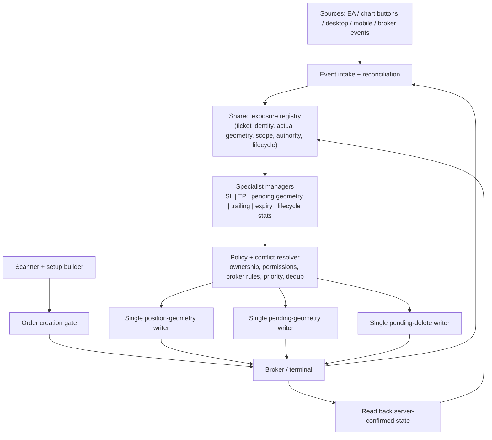

# SmartTradingBot_FINAL — Root Audit Blueprint

Status: work in progress. This is the working checklist for the review branch; it is not a claim that the EA is compiled or runtime-validated.

## Reference
- User-supplied product/reference page: https://www.mql5.com/en/market/product/171441
- Treat this as a conceptual reference only. No proprietary marketplace source is copied into this repository. The page could not be retrieved by the current web connector, so product-specific claims are intentionally not made.

## Safety and release boundaries
- All edits stay on `audit/expose-cleaned-source-20261009`.
- Do not sync this branch to the live MetaTrader `Experts` folder.
- Do not compile the terminal copy until the static audit and refactor are complete.
- Keep `main` and its backup archive untouched until one consolidated final release is ready.
- Compilation, visual inspection in MT5, Strategy Tester results, and demo-forward behavior are separate release gates. None may be marked passed from static analysis alone.

## System invariants
1. One central position-SL writer and one central pending-geometry writer.
2. Verify ticket ownership, symbol permissions, broker stop/freeze distance, tick-size alignment, monotonic SL/entry movement, and server-confirmed geometry.
3. Manual geometry edits grant per-ticket manual authority; automatic trail/profit-protection must not overwrite it until the explicit AUTO action clears that authority.
4. New/recovered exposures must seed ticket geometry and pending-trail recovery state before automated writes.
5. Protect every managed position/pending with a valid initial SL where the user has not explicitly taken manual control.
6. A pending trail may only update its own pending ticket. Once filled, the position manager owns the position.
7. Never increase the accepted structural risk through pending trailing; do not loosen a position SL.
8. Risk sizing must fail closed when a valid cash-risk calculation or legal volume cannot be obtained.
9. Strategy signals must use closed/confirmed bars and must not use future data.
10. Adaptive learning must count genuine discovery/outcome events, not repeated revalidation passes.

## Audit workstreams

### A. Strategy and Buy Stop / Sell Stop geometry
- Confirm H4 bias uses confirmed swings and matches the timestamp of the closed candle being evaluated.
- Confirm M15 structure break uses only pivots that were confirmed before the breakout candle.
- Confirm FVG/OB must be tied to the setup's BOS/displacement, not an unrelated pattern.
- Confirm Buy Stop entry is above the live Ask by a broker-valid distance; Sell Stop entry is below the live Bid.
- Build SL beyond the actual OB risk-side extreme, or the nearest confirmed pre-BOS opposite swing when OB is optional and absent.
- Compute TP/RR after final tick/broker normalization, and reject stale triggers that have already crossed.

### B. Position manager and trailing
- Single-cycle priority: establish missing initial SL first, then profit-lock, then live trailing.
- Profit calculations must be net-of-known opening commission and swap; fail closed if pip cash value cannot be computed.
- Only submit SL changes that improve protection and pass current broker distances.
- Verify the broker's final SL after a successful retcode; refresh geometry from actual terminal values on failures.
- Avoid repeated high-volume debug logging inside tick-level paths.

### C. Pending order manager
- Cover BUY/SELL STOP, BUY/SELL LIMIT, and STOP-LIMIT order types consistently.
- Use per-ticket state, restart reconstruction, bounded retries/backoff, cooldown/step gates, and single central writer.
- Preserve the trigger-to-limit offset on STOP-LIMIT modifications and verify the child limit price after modification.
- Prune inactive/completed ticket state so lifetime memory does not grow with all historical pending orders.
- Confirm manual order edits reset the trail baseline and retain manual authority.

### D. Exposure ownership, restart, and manual authority
- Seed exposure geometry before the first management cycle on attach/restart.
- Seed a new pending order's initial terminal geometry at first transaction intake.
- Transfer per-ticket manual authority from a pending ticket to the filled position where applicable.
- Reconcile closed tickets and stale persistence without affecting unrelated accounts/magics.
- Confirm symbol lease ownership is verified immediately before all broker writes.

### E. Scanner, adaptive engine, and risk
- Distinguish scanner discovery from final candidate revalidation so repeated rebuilds do not inflate adaptive attempts.
- Keep final candidate revalidation on current market data and require the same closed setup timestamp.
- Check symbol-specific trading mode, order permissions, spread, quote age, session, volume limits, pending lifetime, and account trade permissions before placement.
- Verify trade outcomes are aggregated across partial exits and adaptive statistics update only once when a position lifecycle closes.

### F. Source quality and release verification
- Remove only symbols proven to be dead; keep all active strategy logic.
- Run static checks for malformed comments/strings, brace balance, duplicate definitions, unresolved references, and writer counts.
- Then perform one clean MetaEditor compile of the consolidated source and record the exact source hash, compiler output, and resulting EX5 hash.
- Only after compile review: run Strategy Tester on representative symbols/regimes and inspect logs for rejected geometry, modification failures, trailing behavior, and manual-override protection.
- Only after those gates pass: create one consolidated ZIP/commit, update `main`, and perform a single transfer to the canonical terminal.

## Incremental fixes saved on this review branch
- AUTO clears manual overrides only when enabling AUTO, not when disabling it.
- Pending-trail state is rebuilt before the first management cycle and inactive trail records are pruned during processing.
- Exposure geometry is reconciled before the first management write; new managed pending orders seed their initial geometry on intake.
- Revalidation rebuilds no longer increment adaptive attempt counts.
- Net pip-profit conversion returns zero when a valid pip cash value cannot be obtained instead of falling back to gross price movement.
- Per-tick P5A diagnostic spam was removed from the central position-SL writer.
- Setup cooldown timestamps are committed only after a pending order's initial SL is verified.
- H4 trendline validation evaluates the closed candle at its corresponding close time.
- Initial setup SL now anchors beyond the actual OB extreme or a confirmed pre-BOS opposite swing instead of using the already-broken trigger pivot as a near-entry stop.
- Manual pending/hedge commands are being guarded against terminal/account and symbol-direction permissions.

## Known limitation
The changes above are static-review changes only. No compile or runtime pass is claimed for this review branch. Continue auditing, update this document as each workstream is proven, and do not release until every gate has evidence.

## House map — first structural pass (inventory, not functional sign-off)

This is the repository's current architectural map. "Located" means the code/file exists; it does **not** mean its behavior is verified. Each house is audited for responsibility, state ownership, authorized doors, and failure containment.

### Site / foundation
- **Build target:** `MQL5/Experts/SmartTradingBot_FINAL.mq5` (8,665 lines; primary EA; observed blob SHA `955d9961e3da1d855a162ac6f4acf7bf7fc852b8`).
- **Platform boundary:** `#include <Trade/Trade.mqh>` and the terminal/broker API (quotes, symbol permissions, positions, orders, history, terminal Global Variables, timers and chart events).
- **Project-owned include houses:** `MQL5/Include/STB/STB_PendingDistanceResolver.mqh`, `MQL5/Include/STB/STB_PendingTrail.mqh`; adjacent `MQL5/Include/AC/AC_ManualAnalysis.mqh` and `AC_SmartStructure.mqh` are present in the tree, but direct inclusion/use by the primary EA has not yet been established.
- **Release artifact warning:** a compiled `MQL5/Experts/SmartTradingBot_FINAL.ex5` is present in the branch. Its provenance/source correspondence has not been established; it is not evidence that the current MQ5 source compiles.
- **Map/progress records:** this blueprint is the canonical map; `AUDIT_PROGRESS_20261009.md` is the evidence/status log. No new audit folders/files are required.

### Houses, rooms, families, and doors

| House | Main rooms / family | State it owns | Authorized doors / links | Audit status |
|---|---|---|---|---|
| **H0 — EA host & policy foundation** | Inputs; constants; data structures (`Setup`, swing/trend/oscillator/adaptive structs); price/volume normalization; symbol/trading-environment checks | EA-wide policy/configuration and shared utility behavior | Terminal API; calls into other houses through named functions | Located; boundaries under audit |
| **H1 — Market structure & setup construction** | Rates; swing collection; H4 trend/bias; M15 CHoCH/BOS; displacement; FVG; origin/OB; structural SL anchor; setup scoring | Candidate `Setup` data, timestamps, structural prices | Produces setup for scanner/execution; reads market data | Located; temporal correctness not yet signed off |
| **H2 — Adaptive learning & lifecycle statistics** | Profile selection/UCB; attempt counters; setup/profile persistence; position/order profile and risk association; close-deal aggregation | Profile counters, profile identity, lifecycle PnL/risk records | Receives setup and confirmed lifecycle events; must not mutate trade geometry | Located; event-counting/restart boundaries under audit |
| **H3 — Scanner, regime & candidate ranking** | Universe/watchlist; quote/session eligibility; regime and quality scoring; candidate stability/sort/top candidate; final revalidation | Candidate list and scanner diagnostics | Reads H1 setup and market eligibility; passes final candidate to H4 | Located; freshness and duplicate-work boundaries under audit |
| **H4 — Order construction & execution gate** | Pending geometry validation; risk-volume calculation; expiry; final gates; automatic/manual STOP/LIMIT placement; hedge command | Proposed order geometry and placement result | Sole approved order-creation paths should be explicit; crosses broker boundary | Located; all write gates not yet fully proven |
| **H5 — Exposure registry & authority** | Managed ticket/symbol ownership; geometry snapshots; manual override persistence/intake; symbol lease; cycle write dedup; restart reconciliation | Per-ticket ownership, geometry baseline, manual authority, leases | Transaction intake, managers, and broker writers; must block cross-ticket/symbol writes | Located; critical boundary under audit |
| **H6 — Position protection** | Initial SL; profit lock; net pip profit; live trailing; per-cycle position management | Position SL proposal/lock state and accumulated position outcome data | Proposals flow to central position-SL writer; must not loosen SL or override manual authority | Located; state/retcode paths under audit |
| **H7 — Pending-order lifecycle** | Initial pending SL; per-ticket pending trail; retry/backoff/cooldown; restart reconstruction; pending delete; trigger handoff | Pending entry/SL/TP baseline, tracked extreme, retry state | Resolver → central pending geometry writer; central delete door; on fill hands off to H6 | Located; STOP/LIMIT/STOP-LIMIT and ownership paths under audit |
| **H8 — Dashboard & chart controls** | Panel/buttons/visual levels; AUTO toggle; manual STOP/LIMIT/HEDGE/SAVE/TRAIL actions | UI state and explicit user commands | Commands route to H4/H5/H6/H7; UI must not write broker geometry directly | Located; command authorization under audit |
| **H9 — Event and lifecycle orchestrator** | `OnInit`, `OnDeinit`, `OnTick`, `OnTimer`, `OnTradeTransaction`, `OnChartEvent`; `STB_RunManagementCycle` | Event sequencing and per-cycle lifecycle | Tick/timer → single management cycle; trade transaction → exposure intake and closed-deal accounting | Located; ordering/race semantics under audit |

### Physical boundary observations (not yet defect verdicts)
1. The primary EA contains most houses in one 8,665-line translation unit; only pending-distance resolution and pending trailing are separate project-owned STB include files. These are **logical** walls, not compiler-enforced module boundaries.
2. The two STB includes are brought in near the end of the primary EA (around lines 8115–8116), immediately before lifecycle helpers/events. Type visibility, call ordering, and any pre-include references must be checked before changing include placement.
3. The `AC` include files exist but are not among the primary EA's direct `#include` directives. Their status (legacy, standalone, or indirectly required) remains unresolved.
4. The EA source and an EX5 binary coexist in the branch. Until a clean compile records the exact MQ5 hash and output, the EX5 must be treated as an unverified artifact.
5. Repository inventory contains 273 blob files, including broad MQL5 include-library material. Audit scope will distinguish project-owned code from platform/library code; it will not mechanically rewrite vendor/platform libraries.

### Audit evidence protocol
For every house, record: (a) source locations and state variables; (b) public doors/callers; (c) writes and their authorization gates; (d) failure/retcode behavior; (e) restart/manual-edit behavior; (f) cross-house interference tests; (g) evidence and remaining unknowns. Use only **Located**, **Static evidence found**, **Issue confirmed**, **Needs runtime/compiler evidence**, or **Verified within stated scope**. No house is globally "verified" from inventory alone.

## House H7/H5 boundary finding — pending deletion door (static finding; fix not yet applied)

**Finding ID: H7-H5-001 — central delete writer does not enforce the symbol lease at its own boundary.**

Evidence in `MQL5/Experts/SmartTradingBot_FINAL.mq5`:
- `STB_ModifyPendingOrderGeometry()` (around line 1868) checks `STB_SymbolManagementOwnedVerified(symbol)` before issuing `trade.OrderModify`.
- `ModifyPositionSL()` (around line 4680) checks the same verified lease before `trade.PositionModify`.
- `STB_ExecuteOrderDelete()` (around line 8135) selects the ticket and checks neither `STB_SymbolManagementOwnedVerified(symbol)` nor an explicit narrowly scoped authorization token before `trade.OrderDelete`.
- Delete requests are routed through `STB_RequestOrderDelete()`, but that wrapper currently delegates directly to the writer without adding authorization.

**Why the wall matters:** callers such as pending-expiration management are lease-gated before they reach the delete door, but creator rollback paths also call the central delete wrapper. A caller-side check alone is not a durable boundary contract: a future/new caller can bypass it. The single broker-write door should enforce its own authorization, with any deliberate rollback exception explicit and narrow.

**Status:** issue confirmed by source inspection; full caller inventory and safe fix design still in progress. No code change has been made for this finding yet. Before fixing, trace every `STB_RequestOrderDelete` caller and decide how a failed initial-protection rollback can safely delete only the exact order created by that request without violating cross-instance ownership. Then add a targeted static regression check. Runtime/compiler validation remains required.

### H7-H5-001 — caller trace update

All direct call sites found in the primary EA:
- `ManagePendingOrders()` → `STB_RequestOrderDelete(...SERVER_EXPIRATION...)` around line 5737. This path has a preceding `STB_SymbolManagementOwnedVerified(symbol)` check around line 5693.
- `PlaceSetup()` → rollback after accepted order lacks verified initial SL, around line 6176.
- `PlaceManualPendingDirection()` → rollback after accepted STOP order, around line 6504.
- `PlaceManualLimitDirection()` → rollback after accepted LIMIT order, around line 6602.
- `OneClickHedge()` → rollback after accepted hedge pending, around line 4047.
- `STB_RequestOrderDelete()` itself delegates to `STB_ExecuteOrderDelete()` around lines 8181–8185, with no authorization policy of its own.

The four rollback callers are not preceded at the call site by a visible `STB_SymbolManagementOwnedVerified(symbol)` check in the inspected ranges. This does **not** by itself prove they are always unauthorized; it does prove that the central delete door does not independently enforce the invariant. A naive guard added only inside delete could also prevent cleanup of a just-created order if the creator has not acquired the lease. The fix therefore needs coordinated review of the creation gates, lease acquisition, and rollback semantics; do not patch the delete writer in isolation.

## Source-of-truth search — master map not located

A repository-wide tree/name inventory was checked on both available branches (`main` and `audit/expose-cleaned-source-20261009`):
- Only two branches are exposed by the repository.
- The `main` branch root contains only `SmartTradingBot_FINAL_CLEANED_BACKUP_20261009_033230.zip`; it has no browsable source tree or separate architecture document.
- The audit branch contains the working `docs/ROOT_AUDIT_BLUEPRINT.md` and `AUDIT_PROGRESS_20261009.md`, but no separately named master map / architecture contract / system blueprint file was found in the repository tree.
- The EA source contains comments referring to “MASTER BLUEPRINT” and numbered blueprint rules, but these references are not themselves the complete master map and cannot safely be used to reconstruct its full meaning.

**Conclusion:** the canonical master map has **not been located** in the accessible repository contents. The house map above remains a provisional, code-derived inventory only; it must not be treated as a replacement for the user's original master map. Keep the current map clearly labeled provisional until the original document is found or supplied. No source code or release artifact was changed as part of this search.

## Master map — target architecture (source-neutral collaboration)

**Status: proposed architecture target derived from the user's requirements and the current code inventory. This is not yet a statement that the implementation conforms.** Keep this map deliberately small: one shared view of exposures, specialist decision-makers, and a few controlled write doors.

### Four rules that define the whole map

1. **Origin-neutral coverage:** once an exposure is inside the explicitly authorized account/symbol scope, its origin (EA, chart command, desktop, mobile, or broker-side event) does not decide which protection manager may inspect it. The manager decides from current state and its responsibility, not from who created it.
2. **One owner for each kind of state:** the exposure registry owns canonical per-ticket snapshots and authority metadata; specialist managers own only their private calculation/retry state; the policy resolver owns conflict resolution; central writers alone perform broker mutations.
3. **No neighbor-house writes:** a manager may read another house only through a named interface or shared read model. It may submit a proposal, never modify another house's private state or call a broker mutation directly.
4. **Verify, then reconcile:** a successful local API return is not enough. Re-read the terminal/server state, confirm the intended ticket and geometry, and update the shared registry from observed state. If confirmation fails, record the failure and reconcile before retrying.

### Responsibilities at a glance

- **Event intake / reconciler:** normalize events from all origins; reconcile current orders and positions on attach/restart; tolerate duplicate, delayed, or reordered events; do not assume a transaction callback is a complete snapshot.
- **Exposure registry:** canonical ticket/position identity, actual server geometry, authorized scope, manual-control mode, pending-to-position lifecycle links, and restart recovery metadata.
- **SL manager:** propose safe, valid SL geometry for every in-scope exposure it owns; never write to the broker itself.
- **TP manager:** propose TP geometry using the same current snapshot and shared conflict policy; never write to the broker itself.
- **Pending manager:** propose pending entry/SL/TP/trail/expiry changes for that pending ticket only; hand off when it fills.
- **Scanner/setup builder:** discover candidates and produce proposals only; it is not the owner of existing exposure protection.
- **Creation gate:** validate a new order proposal and permissions; creation is separate from management of exposures already found.
- **Policy/conflict resolver:** enforce scope, symbol lease, account/terminal permissions, broker stop/freeze and tick-size constraints, monotonic-protection rules, per-cycle deduplication, and priority between competing proposals.
- **Central writers:** the only code allowed to modify position geometry, modify pending geometry, or delete pending orders. Each writer independently enforces authorization and verifies the server result.
- **Lifecycle/statistics:** consume confirmed events/outcomes; must not mutate geometry or inflate counts through repeated reconciliation.
- **UI/chart controls:** express user intent through commands; no direct broker writes from UI code.

### One policy point that must be resolved before code changes

The new source-neutral goal changes how the existing blueprint currently describes manual edits. The old rule treats a manual geometry edit as per-ticket manual authority until AUTO is explicitly enabled. The proposed map separates **origin** from **authority**: origin never excludes an exposure from inspection, while a deliberate, explicit **MANUAL HOLD** state may suspend automatic proposals for that ticket. A manual edit alone should not silently become a permanent bypass if the intended goal is automatic protection for all sources. This is a design decision to confirm; do not change code until it is settled.

### Current-code fit and known gaps

- The current EA already has a shared management cycle and central mutation paths for position modification, pending modification, and pending deletion. This is a useful starting shape, but it does not prove every writer enforces the same authorization contract.
- The static finding **H7-H5-001** remains open: the central pending-delete writer does not enforce the symbol lease at its own boundary. Resolve the creation/rollback exception deliberately; do not add a blind guard that can block cleanup of a newly created invalid order.
- The houses mostly live inside one large EA translation unit. These are logical boundaries until code structure and call paths enforce them.
- This target map is informed by Microsoft's guidance on explicit component responsibilities/dependencies and AWS guidance on bounded contexts/interfaces, plus MQL5's official description of terminal-originated trade transactions and the possibility that state can change while an event handler runs. See:
  - https://learn.microsoft.com/azure/architecture/guide/architecture-styles
  - https://learn.microsoft.com/azure/architecture/guide/design-principles
  - https://docs.aws.amazon.com/prescriptive-guidance/latest/hexagonal-architectures/overview.html
  - https://www.mql5.com/en/docs/constants/structures/mqltradetransaction
  - https://www.mql5.com/en/docs/basis/function/events

### Acceptance tests for the map (not yet run)

- An in-scope exposure created by EA, desktop, mobile, or chart command is discovered and reconciled without relying on its origin.
- SL and TP proposals for the same ticket are resolved from one fresh snapshot; neither writer can erase the other's update through stale geometry.
- No specialist or UI component can reach broker mutation APIs except through the central writers.
- Every central writer independently checks ticket identity, authorized scope, symbol lease/permissions, broker constraints, and final server state.
- Restart, duplicate/reordered trade events, partial fills, pending-to-position transition, and failed modification leave the registry consistent with observed terminal state.
- A ticket outside the authorized scope is never modified, even if visible to the EA.
- Explicit manual hold / AUTO resume semantics are deterministic and documented before implementation.
